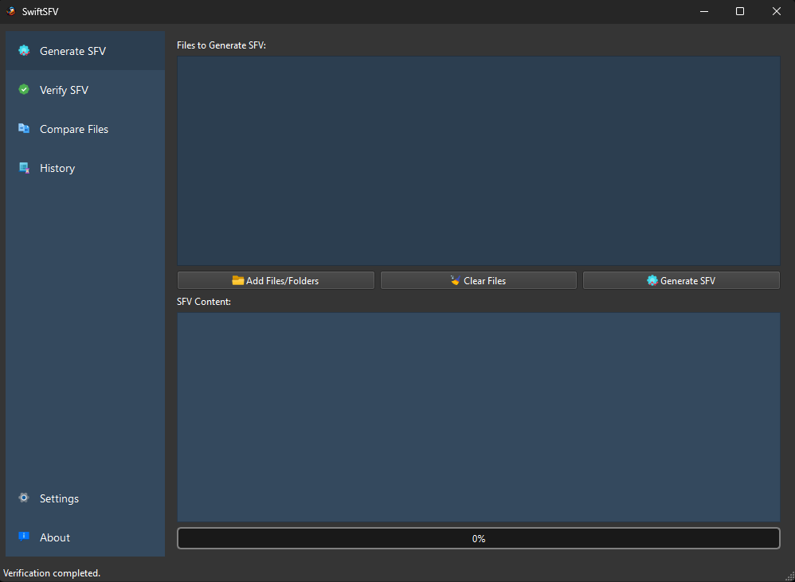
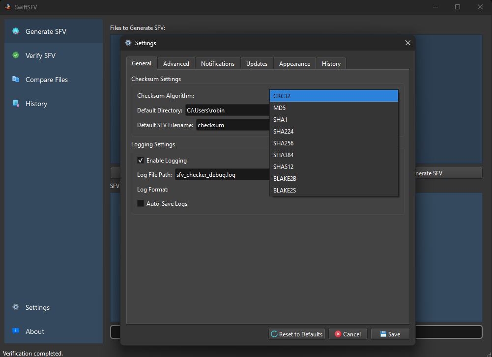
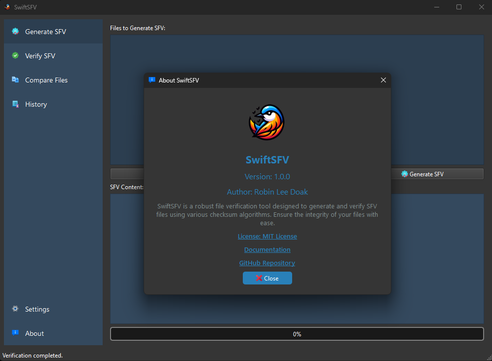

# SwiftSFV

SwiftSFV is a comprehensive GUI application for generating, verifying, and comparing SFV (Simple File Verification) files, comparing files and directories, and ensuring data integrity. Built with Python and PyQt6, SwiftSFV provides an intuitive interface for managing checksums using a wide range of algorithms, including CRC32, MD5, SHA-1, SHA-256, SHA-512, and many more.


**Developer**: [Robin Doak](https://github.com/skillerious)

**Repository URL**: [https://github.com/skillerious/SwiftSFV](https://github.com/skillerious/SwiftSFV)

---

## Table of Contents

- [Features](#features)
- [Screenshots](#screenshots)
- [Requirements](#requirements)
- [Installation](#installation)
- [Usage](#usage)
  - [Generating SFV Files](#generating-sfv-files)
  - [Verifying SFV Files](#verifying-sfv-files)
  - [Comparing Files or Directories](#comparing-files-or-directories)
  - [Customizable Themes](#customizable-themes)
  - [History](#history)
  - [Settings and Preferences](#settings-and-preferences)
- [Error Handling](#error-handling)
- [Development](#development)
- [Contributing](#contributing)
- [License](#license)
- [Contact](#contact)

## Features

- **Generate SFV files**: Create SFV files for selected files or directories using a variety of checksum algorithms.
- **Verify SFV files**: Verify the integrity of files against an existing SFV file.
- **Compare files or directories**: Compare two files or directories to check for differences.
- **Support for Multiple Algorithms**: Choose from CRC32, MD5, SHA-1, SHA-224, SHA-256, SHA-384, SHA-512, BLAKE2B, BLAKE2S, SHA3 family, and more.
- **Drag-and-Drop Interface**: Easily add files and directories via drag-and-drop.
- **Customizable Themes**: Switch between multiple themes (Dark, Light, Blue, Green, Red, Purple) to customize the application's appearance.
- **Dynamic Theme Application**: Themes are applied immediately without restarting the application.
- **Customizable Settings**: Choose default checksum algorithms, default directories, logging preferences, and UI themes.
- **History Tracking**: Keeps a log of previously performed operations, including generated SFV files, verifications, and comparisons.
- **Session Management**: Save and load sessions to continue work at a later time.
- **Multithreading Support**: Performs tasks using threading to keep the UI responsive.
- **Progress Indicators**: Visual progress bars and status messages for long-running tasks.
- **Cross-Platform Compatibility**: Works on Windows, macOS, and Linux.
- **Modern UI Design**: Intuitive and user-friendly interface with theme support.

## Requirements

- Python 3.8+
- PyQt6

## Installation

To install the required dependencies, use:

```sh
pip install PyQt6
```

## Usage

To run the application, execute the `main.py` file:

```sh
python main.py
```

### Generating SFV Files

1. **Navigate to "Generate SFV"**
   - On the sidebar, select **Generate SFV**.

2. **Add Files or Folders**
   - **Drag and Drop**: Drag files or folders into the file list area.
   - **Add Files**: Click the **Add Files** button to select files via a dialog.
   - **Add Folders**: Click the **Add Folders** button to select directories via a dialog.

3. **Clear Files (Optional)**
   - Use the **Clear Files** button to remove all files from the list.

4. **Generate SFV**
   - Click the **Generate SFV** button. A progress bar will indicate the task's progress.

5. **Save SFV File**
   - Once generation is complete, you will be prompted to save the SFV file. Choose a location and filename.

6. **View Output**
   - The generated SFV content will be displayed in the output area.

### Verifying SFV Files

1. **Navigate to "Verify SFV"**
   - On the sidebar, select **Verify SFV**.

2. **Select SFV File**
   - Click the **Select SFV File** button and choose an existing SFV file.

3. **Verify SFV**
   - After selecting the SFV file, click the **Verify SFV** button. The application will verify each file listed in the SFV file.

4. **View Results**
   - The verification results will be displayed in the output area, indicating if files are OK, mismatched, or missing.

### Comparing Files or Directories

1. **Navigate to "Compare Files"**
   - On the sidebar, select **Compare Files**.

2. **Select Paths**
   - **Path 1**: Use the **Select Path 1** button to choose the first file or directory.
   - **Path 2**: Use the **Select Path 2** button to choose the second file or directory.

3. **Compare**
   - Click the **Compare** button to start the comparison.

4. **View Comparison Results**
   - The output area will display whether the files or directories are identical or list the differences.

### Customizable Themes

SwiftSFV allows you to customize the application's appearance by choosing from multiple themes.

1. **Navigate to "Settings"**
   - Click on **Settings > Preferences** in the menu bar.

2. **Select "Appearance" Tab**
   - In the settings dialog, select the **Appearance** tab.

3. **Choose a Theme**
   - From the **UI Theme** dropdown, select your preferred theme:
     - **Dark** (default)
     - **Light**
     - **Blue**
     - **Green**
     - **Red**
     - **Purple**

4. **Save Settings**
   - Click **Save** to apply the new theme immediately.

**Note**: Themes are applied dynamically, and you do not need to restart the application.

### History

- **View History**
  - Navigate to the **History** section to view a log of all generated SFV files, verifications, and comparisons.
- **Clear History**
  - Use the **Clear History** button to remove all history entries.
- **Copy to Clipboard**
  - Copy the history entries to the clipboard for reference.

### Settings and Preferences

Access the settings by clicking on **Settings > Preferences** in the menu bar.

- **Checksum Settings**
  - **Default Checksum Algorithm**: Choose between CRC32, MD5, SHA-1, SHA-256, SHA-512, BLAKE2, SHA3, and more.
  - **Default SFV Filename**: Specify a default filename for generated SFV files.
  - **Default Directory**: Set a default directory for file dialogs.
- **Logging Settings**
  - **Enable Logging**: Toggle logging of verification results.
  - **Log File Path**: Specify the path where log files will be saved.
  - **Log Format**: Choose between TXT or CSV format for log files.
  - **Auto-Save Logs**: Enable or disable automatic saving of logs.
- **Advanced Settings**
  - **Output Path Type**: Choose whether to use relative or absolute paths in SFV files.
  - **Delimiter**: Select the delimiter used between file paths and checksums in SFV files (Space, Tab, or Custom).
  - **Custom Delimiter**: Specify a custom delimiter if selected.
  - **Automatically Verify After Generation**: Enable automatic verification after generating an SFV file.
  - **Detailed Logging**: Enable detailed logging for debugging purposes.
  - **Checksum Comparison Mode**: Choose between Quick or Full checksum comparison.
  - **Number of Threads**: Set the number of threads for checksum calculations.
  - **Exclude File Types**: Specify file extensions to exclude from processing.
- **Notifications Settings**
  - **Enable Desktop Notifications**: Toggle desktop notifications for operations.
- **Updates Settings**
  - **Automatically Check for Updates**: Enable automatic checking for application updates.
- **Appearance Settings**
  - **UI Theme**: Choose from multiple themes to customize the application's look.
  - **Font Size**: Adjust the font size of the application.
  - **Language**: Select the application language (English, Spanish, French, etc.).
- **History Settings**
  - **Recent Files Limit**: Set the maximum number of recent files/directories to keep in history.

After adjusting settings, click **Save** to apply changes.

## Screenshots









## Error Handling

SwiftSFV includes a global exception handler for any unexpected issues. Errors are logged to a file (`sfv_checker_debug.log`) and also displayed in a message box.

- **Permission Handling**: The application checks for write permissions before saving files and prompts the user if they do not have the necessary permissions.
- **Invalid Files**: Warns users if they select invalid files (e.g., shortcuts or inaccessible files) for processing.
- **Comprehensive Logging**: Logs detailed information for troubleshooting purposes.

## Development

The project uses a modular structure to ensure the separation of GUI, logic, and background tasks.

- **`checksum_utils.py`**: Contains functions for calculating checksums using various algorithms.
- **`settings.py`**: Manages application settings and preferences.
- **`settings_dialog.py`**: Provides the user interface for adjusting settings.
- **`main.py`**: The main application file that initializes the UI and handles user interactions.
- **Background Tasks**:
  - **`ChecksumTask`**: A background task for generating SFV files.
  - **`VerificationTask`**: A background task for verifying the contents of an SFV file.
  - **`CompareTask`**: A background task for comparing two files or directories.

### Adding New Features

- **Support for Additional Hash Algorithms**: Implemented using `hashlib` to support a wide range of algorithms.
- **Dynamic Theme Application**: Themes can be changed on the fly and are applied immediately.
- **Enhanced Error Handling**: Improved error messages and handling of permission issues.

### Contributing

Contributions are welcome! Feel free to submit issues or pull requests for improvements.

1. **Fork the Repository**
2. **Create a Feature Branch**
   ```sh
   git checkout -b feature/YourFeature
   ```
3. **Commit Your Changes**
   ```sh
   git commit -m "Add YourFeature"
   ```
4. **Push to Your Branch**
   ```sh
   git push origin feature/YourFeature
   ```
5. **Open a Pull Request**

## License

This project is licensed under the MIT License. See the [LICENSE](LICENSE) file for more details.

## Contact

For any inquiries, you can reach out via the GitHub repository: [https://github.com/skillerious/SwiftSFV](https://github.com/skillerious/SwiftSFV)

---

**Note**:

- Ensure you have a directory called `images` containing appropriate icons (`generate.png`, `verify.png`, `compare.png`, etc.) and screenshots for use in the application.
- Missing icons or images will be indicated by warnings in the application log.
- The application requires the `themes` directory with the following `.qss` files for themes:
  - `dark_theme.qss`
  - `light_theme.qss`
  - `blue_theme.qss`
  - `green_theme.qss`
  - `red_theme.qss`
  - `purple_theme.qss`

---

Feel free to explore the application and customize it to your liking. If you encounter any issues or have suggestions for improvement, don't hesitate to open an issue on GitHub.
